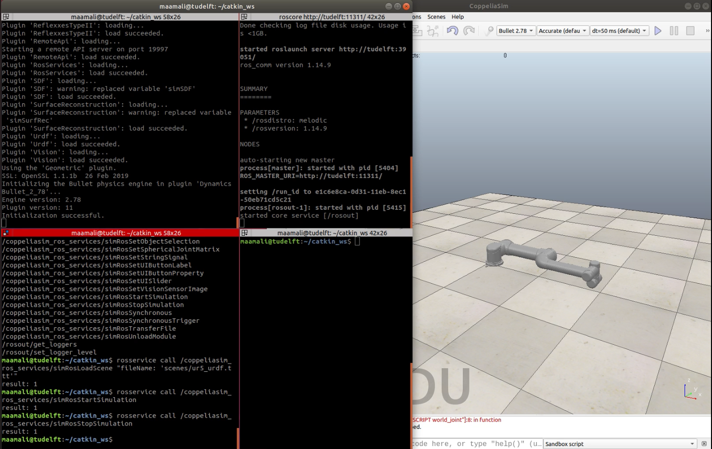

# coppeliasim_ros_services
A collection of ROS services and publishers wrapping the [CoppeliaSim APIs][]. These services and publishers use the `.msg`s and `.srv`s files defined in the [coppeliasim_msgs_srvs][] package. This package enables ROS to control the simulation inside CoppeliaSim (e.g. start/stop the simulation, loading/unloading scenes/modules, ... etc), and it allows CoppeliaSim to publish important information about the simulation (e.g. clock, simulation_state, time_step, simulation_time) on ROS topics.

### Dependencies
- [coppeliasim_msgs_srvs][]: contains the header files of the msgs/srvs used in this package.

### Building 
The following instructions assume that a Catkin workspace has been created at `$HOME/catkin_ws` and a CoppeliaSim directory is located in the directory `$HOME/CoppeliaSim`. You always can update the paths based on your machine setup.

```bash
# change to the src directory in your Catkin workspace
cd $HOME/catkin_ws/src

# Clone coppeliasim_msgs_srvs pkg 
git clone https://github.com/tud-cor/coppeliasim_ros_services

# change to the root of the workspace
cd ..

# build the workspace (using catkin_tools)
 catkin build
 
# After building, you can check if the plugin 'libsimExtRosServices.so' was successfuly created by listing the content of the devel/lib
ls devel/lib | grep 
libsimExtRosServices.so
```

### Running
The generated plugin should be loaded while starting CoppeliaSim, this can be done by copying the file 'libsimExtRosServices.so' to the main directory of CoppeliaSim (ie: `$HOME/CoppeliaSim`):
```
# Copy the generated plugin to CoppeliaSim directory
cp  $HOME/catkin_ws/devel/lib/libsimExtRosServices.so  $HOME/CoppeliaSim/
```
In a new terminal start a ROS master before you start CoppelliaSim:
```
roscore
```
In another terminal run CoppeliaSim:
```
# change to CoppeliaSim dir 
cd $HOME/CoppeliaSim

# run CoppeliaSim
./coppeliaSim.sh
```
or you can launch coppeliaSim using the [coppeliasim_run][] package:
```
rosrun coppeliasim_run start_coppeliasim
```

In the same terminal running CoppeliaSim, you can see the following message indicating a successful load of the `RosServices` plugin:
```
Plugin 'RosServices': loading...
Plugin 'RosServices': load succeeded.
```
In new terminal, you can check all the available services and topics offered and publised by the plugin:
- services: all service offered by the plugin will have `/coppeliasim_ros_services/` as a prefix
```
rosservice list
```
- topics: the two main topics published by the plugin are `/clock` and `/info`
```
rostopic list
```

### Usage
The plugin publishes to two topics (`/clock` and `/info`), and offers many services. Here is an example of how you can use some of these services:
- starting the simulation
```
# service_request is empty, service_response is an integer indicating successful operation 
 rosservice call /coppeliasim_ros_services/simRosStartSimulation
```

- Loading a module: loading the [coppeliasim_ros_control][] module (file: `libsimExtRosControl.so`, name: `RosControl`)
```
# service_request should conatins a path to module_file and module_name, service_response is an integer represents the pluginHandle  
rosservice call /coppeliasim_ros_services/simRosLoadModule  " fileName: 'path/to/file'  pluginName: 'pluginName' " 
```

For more information about all the services, check the [coppeliaSim APIs][] page.


### Example
Refer to the [ur5_coppeliasim_roscontrol][] package to see how you can use the `RosServices` plugin to control the simulation of a UR5 robot in CoppeliaSim.


### video
[](https://www.youtube.com/watch?v=t0-VEyB9-0w&ab_channel=mahmoudali)


[coppeliasim_ros_control]: https://github.com/tud-cor/coppeliasim_ros_control
[coppeliasim_run]: https://github.com/tud-cor/coppeliasim_run
[coppeliasim_msgs_srvs]: https://github.com/tud-cor/coppeliasim_msgs_srvs 
[coppeliasim_ros_services]: https://github.com/tud-cor/coppeliasim_ros_services
[Coppeliasim_msgs_srvs]: https://github.com/tud-cor/Coppeliasim_msgs_srvs
[vrep_plugin]: https://github.com/jocacace/vrep_plugin
[coppeliasim]: https://www.coppeliarobotics.com/
[ur5_coppeliasim_roscontrol]: https://github.com/tud-cor/ur5_coppeliasim_roscontrol
[simStartSimulation()]: https://www.coppeliarobotics.com/helpFiles/en/regularApi/simStartSimulation.htm
[simLoadScene()]: https://www.coppeliarobotics.com/helpFiles/en/regularApi/simLoadScene.htm
[coppeliaSim APIs]: https://www.coppeliarobotics.com/helpFiles/en/apiFunctionListCategory.htm

